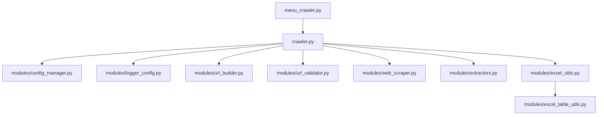

# CURRENT_STATE_ANALYSIS.md

## 1. Inventory of Files and Folders
Here is the complete inventory of the project files, their sizes, and their roles in the system.

### Root Directory
* **[crawler.py](file:///c:/GitHub/mobilebg-carcrawler/crawler.py)** (6,684 bytes): The main CLI entry point. Coordinates URL building, validation, page scraping, detail extraction, price analysis, and Excel exporting.
* **[menu_crawler.py](file:///c:/GitHub/mobilebg-carcrawler/menu_crawler.py)** (13,317 bytes): Interactive CLI menu that allows selecting presets, configures crawl settings (speed, pages), creates a temporary `.env`, and triggers `crawler.py` as a subprocess.
* **[.env](file:///c:/GitHub/mobilebg-carcrawler/.env)** (688 bytes): Stores search and output configuration settings.
* **[requirements.txt](file:///c:/GitHub/mobilebg-carcrawler/requirements.txt)** (51 bytes): Specifies external dependencies (`requests`, `beautifulsoup4`, `openpyxl`, `python-dotenv`).
* **[README.md](file:///c:/GitHub/mobilebg-carcrawler/README.md)** (2,925 bytes): General instructions for installation and run options.
* **[crawler.log](file:///c:/GitHub/mobilebg-carcrawler/crawler.log)** (47,090 bytes): Session logging output.

### modules/ Directory
* **[modules/__init__.py](file:///c:/GitHub/mobilebg-carcrawler/modules/__init__.py)** (463 bytes): Exposes submodules.
* **[modules/config_manager.py](file:///c:/GitHub/mobilebg-carcrawler/modules/config_manager.py)** (1,644 bytes): Manages loading of the environment configuration.
* **[modules/logger_config.py](file:///c:/GitHub/mobilebg-carcrawler/modules/logger_config.py)** (1,439 bytes): dual logging configuration (console & file).
* **[modules/url_builder.py](file:///c:/GitHub/mobilebg-carcrawler/modules/url_builder.py)** (2,300 bytes): Constructs mobile.bg search URL.
* **[modules/url_validator.py](file:///c:/GitHub/mobilebg-carcrawler/modules/url_validator.py)** (2,257 bytes): Verifies search URL accessibility and checks if ads are returned.
* **[modules/web_scraper.py](file:///c:/GitHub/mobilebg-carcrawler/modules/web_scraper.py)** (7,392 bytes): Handles multi-page pagination crawl to gather listing links.
* **[modules/extractors.py](file:///c:/GitHub/mobilebg-carcrawler/modules/extractors.py)** (13,544 bytes): Extracts detailed fields (Price BGN/EUR, phone, extras, location, description, color, etc.) from an individual listing URL.
* **[modules/excel_utils.py](file:///c:/GitHub/mobilebg-carcrawler/modules/excel_utils.py)** (6,665 bytes): Exporters to write rows to Excel sheets and apply table styles.
* **[modules/excel_table_utils.py](file:///c:/GitHub/mobilebg-carcrawler/modules/excel_table_utils.py)** (1,130 bytes): Sizes table range safely.

### presets/ Directory
* Contains 10 preset search configurations (e.g. `.env.audi-a4`, `.env.tesla-model3`) mapping to common car models and budgets, plus a `README.md`.

### Tests/ Directory
* Contains unit/functional tests (`test_pagination.py`, `test_price_extraction.py`, `run_all_tests.py`, `system_status.py`, etc.) for validation.

---

## 2. Dependency Graph

* **External Dependencies**: `requests` (HTTP client), `beautifulsoup4` (HTML parser), `openpyxl` (Excel manipulation), `python-dotenv` (environment variables).

---

## 3. Code Architecture Summary
The project follows a modular scripting architecture:
- **CLI Controllers**: `crawler.py` and `menu_crawler.py` act as controllers coordinating execution.
- **Utility Modules**: Single-responsibility scripts located in `modules/` handle configuration, logging, HTTP requests, parsing, and Excel formatting.
- **State Management**: Transferred primarily through environment variables and local files (`.env` files, temporary `.env` files, `.xlsx` exports).

---

## 4. Key Functions and Methods
* **`build_mobilebg_search_url`**: Combines environmental options (brand, model, price limits, power limits) to return a mobile.bg search URL.
* **`validate_search_url`**: Checks if the URL returns a 200 response and confirms it does not display a "No ads found" message.
* **`get_all_listing_links`**: Fetches pages sequentially using pagination links, parsing and returning a set of listing URLs.
* **`extract_car_info_unified` / `extract_car_info_mobile`**: Fetches a specific car page, parses details (extracting fields like `Brand`, `Model`, `Price_EUR`, `Price_BGN`, `Phone`, `Location`, `Car Extras`, `Описание`).
* **`export_to_excel`**: Formats and writes the scraped items into an Excel sheet.

---

## 5. Performance and Technical Observations
* **Performance**: Scrapes sequentially. A large search volume (e.g., 200+ cars) with a `0.8s` delay can take several minutes.
* **Resilience**: The parsing uses selective heuristics based on CSS selectors (`mpLabel`, `item`, `.Price`) and regular expressions. Since site designs change, this parser is vulnerable to layout updates.
* **Security**: No authentication is required for crawling; uses standard headers to prevent basic blocking.

---

## 6. Plain-Language Summary
This project is a CLI tool designed to crawl and scrape car listings from mobile.bg based on configurable search parameters (brand, model, price range, fuel type, etc.). It exports the results into styled Excel files with structured columns containing detailed specifications, price analysis, and links.
